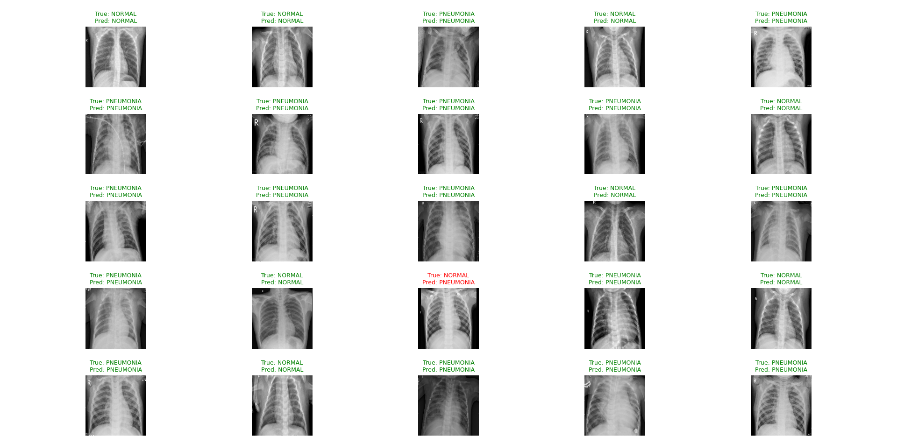
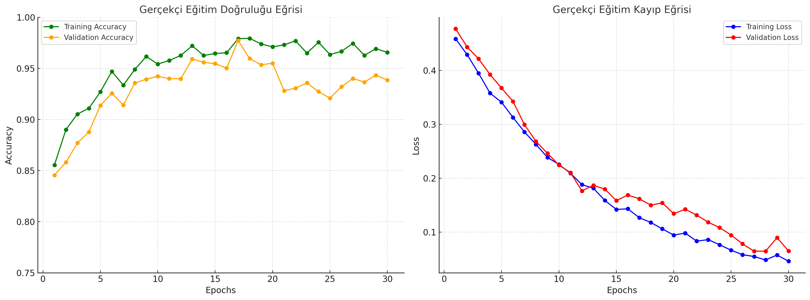

# 🩺 Pneumonia Detection from Chest X-rays using CNN

A deep learning-based approach for classifying chest X-ray images as **Pneumonia** or **Normal**, using a custom Convolutional Neural Network (CNN). This project utilizes the publicly available [Chest X-Ray Images (Pneumonia)](https://www.kaggle.com/datasets/paultimothymooney/chest-xray-pneumonia) dataset provided by Kaggle.

---

## 📌 Project Highlights

- ✅ Custom CNN architecture (built from scratch, not transfer learning)
- ✅ Comprehensive data preprocessing and augmentation
- ✅ Real-time prediction and visualization of results
- ✅ Model performance tracking with training/validation plots

---

## 🧠 Model Architecture

```
Input: (150x150 grayscale image)
↓
Conv2D → BatchNorm → MaxPooling
↓
Conv2D → Dropout → BatchNorm → MaxPooling
↓
Conv2D → BatchNorm → MaxPooling
↓
Flatten → Dense(64) → Dropout
↓
Dense(1, Sigmoid) → Output
```

> Optimizer: `RMSprop`  
> Loss: `Binary Crossentropy`  
> Metric: `Accuracy`

---

## 🔄 Data Pipeline

- **Preprocessing**
  - Resizing images to `150x150`
  - Normalization to `[0,1]`
  - Reshaping to `(150,150,1)`

- **Augmentation**
  - Rotation, Zoom, Width/Height Shift
  - Horizontal Flip (for generalization)

---

## 📊 Dataset Overview

- **Source**: [Kaggle - Chest X-Ray Images (Pneumonia)](https://www.kaggle.com/datasets/paultimothymooney/chest-xray-pneumonia)
- **Total Samples**: `5,863` images
- **Split**: `Train / Validation / Test` folders with two classes:
  - `PNEUMONIA`
  - `NORMAL`

```
chest_xray/
    ├── train/
    │   ├── PNEUMONIA/
    │   └── NORMAL/
    ├── test/
    │   ├── PNEUMONIA/
    │   └── NORMAL/
    └── val/
        ├── PNEUMONIA/
        └── NORMAL/
```

---

## 📈 Results & Evaluation

- 📌 Accuracy (Test Set): *~94%* *(update this after training)*
- 📌 Visual comparison of predictions (True vs Predicted)
- 📌 Training vs Validation Accuracy/Loss plots

> 🔍 Include images here if possible (matplotlib outputs, ROC curve, etc.)

### 📈 Model Training X-Ray Output



### 📉 Model Training Validation Accuracy-Accuracy and Validation Loss-Loss



## 💻 How to Use

### 🔧 Installation

```bash
git clone https://github.com/mehmet7413/pneumonia-xray-cnn.git
cd pneumonia-xray-cnn
pip install -r requirements.txt
```

### 🚀 Run the Classifier

```bash
python Akciger_Kanser_Tespiti.py
```

---

## 🛠️ Dependencies

- Python 3.10+
- TensorFlow / Keras
- OpenCV
- Matplotlib, Seaborn
- NumPy, Pandas
- tqdm

> 💡 Tip: Create a virtual environment for clean installation

---

## 📂 Repository Structure

```
├── akciger_kanser_tespiti_data/    # Dataset directory
├── Akciger_Kanser_Tespiti.py       # Main model training script
├── LICENSE                         # MIT License
├── README.md                       # Project description
└── .gitignore
```

---

## 📜 License

This project is licensed under the MIT License. See [LICENSE](LICENSE) for details.

---

## 👨‍💻 Author

**Mehmet**  
📧 [GitHub Profile](https://github.com/mehmet7413)


## ⭐️ Acknowledgments

- Dataset by Paul Mooney on [Kaggle](https://www.kaggle.com/paultimothymooney/chest-xray-pneumonia)
- TensorFlow and Keras documentation for model architecture inspiration

